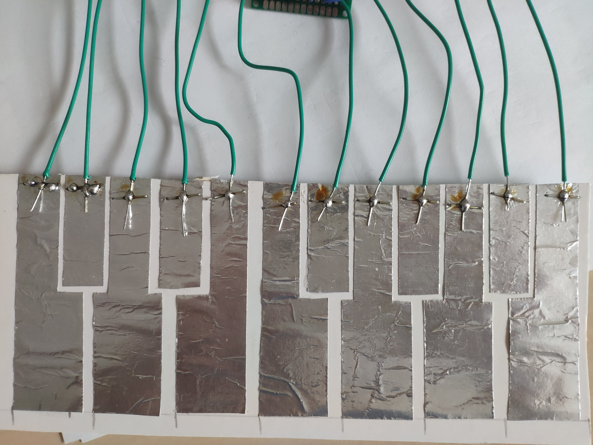

# TouchMIDI
#### Proiect curs SMP - Stanciulescu Andrei, 333AA

## Introducere
In acest proiect voi programa o placa de dezvoltare [FRDM KL25Z](https://www.nxp.com/design/development-boards/freedom-development-boards/mcu-boards/freedom-development-platform-for-kinetis-kl14-kl15-kl24-kl25-mcus:FRDM-KL25Z) sa se comporte precum un dispozitiv MIDI prin USB. Placa dispune de 2 porturi mini USB, unul fiind interfata OpenSDA prin care se incarca programele, se face debugging si se comunica prin portul serial, iar cel de-al doilea poate fi folosit pentru a implementa orice functionalitate din stack-ul USB. In cadrul acestui proiect voi implenta o claviatura MIDI prin USB cu 12 taste.

## Implementare hardware
Implementarea hardware este una simpla, singurele periferice atasate placii de dezvoltare fiind tastele claviaturii. In acest caz am ales sa nu folosesc butoane mecanice, ci sa detectez atingerea pe niste suprafete metalice ce reprezinta tastele.  
 
Pentru a detecta atingerea suprafetelor de metal folosesc un circuit de tip **AC hum switch**. In diagrama de mai jos este exemplificat ansamblul pentru o tasta. Acesta este repetat pentru toate cele 12 taste si realizat pe o placa de prototipare.  
 
Terminalul notat **Digital out** se conecteaza la unul din pinii digitali ai placii de dezvoltare. Atunci cand folia nu este atinsa, tensiunea va aparea 1 logic. Atunci cand este atinsa suprafata metalica, va aparea un curent prin baza tranzistorului, acesta va incepe sa conduca, iar tensiunea va deveni 0 digital. Iesirea nu va ramane 0, ci va oscila intre 0 si 1 cu aproximativ 50 Hz cat timp suprafata este atinsa. Curentul care apare la atingerea placii de metal este generat de campul electromagnetic creat de reteaua de curent alternativ de 220V, deci probabil detectarea nu va functiona la fel de bine in aer liber. Putem detecta aceste oscilatii numarand numarul de tranzitii de la 1 la 0 ale fiecarui pin in parte pentru o perioada determinata de timp, si astfel putem distinge data suprafetele metalice au fost atinse sau nu.

## Implementare software
Pentru implementarea partii software a proiectului, am folosit platforma [mbed](https://os.mbed.com/) oferita de ARM pentru microcontroller-ele sale. O alta optiune este programarea folosind mediul MCUXpresso, oferit de NXP. Am ales sa folosesc prima optiune intrucat aceasta contine o biblioteca ce implementeaza protocolul MIDI prin USB, deci nu va fi nevoie sa scriu intreg stack-ul USB de la 0. Platforma mbed ofera de asemenea o interfata mai familiara cu placa de dezvoltare, fiind asemanatoare cu mediul de dezvoltare Arduino IDE.  

La inceput, programul initializeaza un bus de 12 pini digitali de intrare, acestia fiind iesirile circuitului fiecarei taste, apoi sunt declarate toate variabilele ce vor fi necesare functionarii.

In interiorul buclei infinite, mai intai verificam daca e vreo tasta "apasata". Timp de 100ms numaram cate tranzitii de nivel apar pe fiecare din cei 12 pini. Daca numarul de tranzitii este mai mare decat 5, consideram ca tasta e atinsa, altfel nu. Apoi iteram prin starile vechi ale tastelor si trimitem mesaje doar daca apare vreo modificare (daca o tasta care era apasata nu mai este apasata, sau daca este apasata o tasta ce nu era apasata inainte). Facem acest lucru deoarece nu dorim ca atunci cand o tasta este atinsa pentru mai mult timp sa fie transmise in continuu mesaje de NoteOn, deoarece acestea vor reseta sinteza notei curente in software-ul de procesare audio. Dupa ce facem aceasta verificare, trimitem mesajele necesare MIDI catre calculator. In final, facem update variabilei ce tine starile vechi ale tastelor, apoi repetam bucla.

## Recunoasterea dispozitivului USB

Atunci cand este conectata la un calculator folosind portul marcat **KL25Z**, placa de dezvoltare va fi recunoscuta ca un device **Mbed Audio**. Acesta poate fi apoi selectat in orice DAW ca dispozitiv de intrare MIDI. Mai jos se pot observa mesajele primite de software-ul MIDIViewer, care a fost folosit si pentru debugging in realizarea aplicatiei. 
