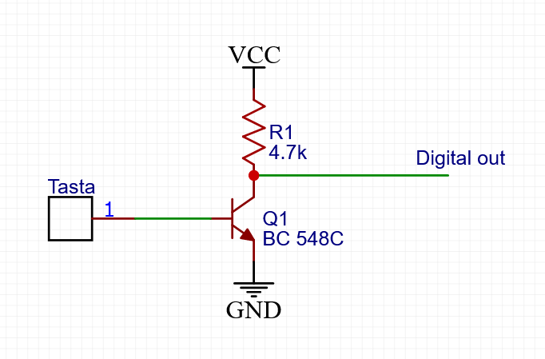

# TouchMIDI
#### Proiect curs SMP - Stanciulescu Andrei, 333AA

## Introducere
In acest proiect voi programa o placa de dezvoltare [FRDM KL25Z](https://www.nxp.com/design/development-boards/freedom-development-boards/mcu-boards/freedom-development-platform-for-kinetis-kl14-kl15-kl24-kl25-mcus:FRDM-KL25Z) sa se comporte precum un dispozitiv MIDI prin USB. Placa dispune de 2 porturi mini USB, unul fiind interfata OpenSDA prin care se incarca programele, se face debugging si se comunica prin portul serial, iar cel de-al doilea poate fi folosit pentru a implementa orice functionalitate din stack-ul USB. In cadrul acestui proiect voi implenta o claviatura MIDI prin USB cu 12 taste.

## Implementare hardware
Implementarea hardware este una simpla, singurele periferice atasate placii de dezvoltare fiind tastele claviaturii. In acest caz am ales sa nu folosesc butoane metalice, ci sa detectez atingerea pe niste suprafete metalice ce reprezinta tastele.  
 
Pentru a detecta atingerea suprafetelor de metal folosesc un circuit de tip **AC hum switch**. In diagrama de mai jos este exemplificat ansamblul pentru o tasta. Acesta este repetat pentru toate cele 12 taste si realizat pe o placa de prototipare.  
 
Terminalul notat **Digital out** se conecteaza la unul din pinii digitali ai placii de dezvoltare. Atunci cand folia nu este atinsa, tensiunea va aparea 1 logic. Atunci cand este atinsa suprafata metalica, va aparea un curent prin baza tranzistorului, acesta va incepe sa conduca, iar tensiunea va deveni 0 digital. Iesirea nu va ramane 0, ci va oscila intre 0 si 1 cu aproximativ 50 Hz cat timp suprafata este atinsa. Curentul care apare la atingerea placii de metal este generat de campul electromagnetic creat de reteaua de curent alternativ de 220V, deci probabil detectarea nu va functiona la fel de bine in aer liber. Putem detecta aceste oscilatii numarand numarul de tranzitii de la 1 la 0 ale fiecarui pin in parte pentru o perioada determinata de timp, si astfel putem distinge data suprafetele metalice au fost atinse sau nu.
